# UML Diagrams — Attendance Analyzer

All diagrams are written in **PlantUML** syntax. Render them at https://www.plantuml.com/plantuml or using a PlantUML VS Code extension.

---

## 1. Use Case Diagram

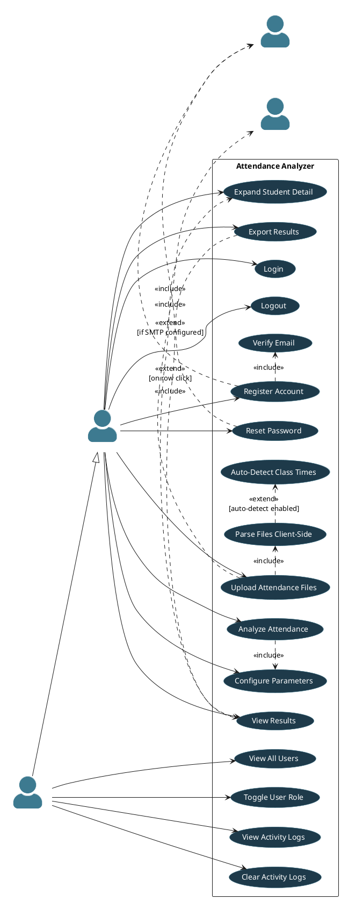

---

## 2. Class Diagram

```plantuml
@startuml class_diagram
skinparam classBackgroundColor #1e3a4a
skinparam classBorderColor #3d7a90
skinparam classHeaderBackgroundColor #3d7a90
skinparam classFontColor #ffffff
skinparam classAttributeFontColor #cce8f4
skinparam arrowColor #3d7a90
skinparam stereotypeCBackgroundColor #3d7a90

' ─── Domain Types ───────────────────────────────────────

class AttendanceConfig {
  +classStart: string
  +classEnd: string
  +lateThreshold: number
  +absentThreshold: number
  +maxScore: number
  +latePenalty: number
  +absentPenalty: number
  +timesLocked: boolean
}

class RawRecord {
  +name: string
  +id?: string
  +role?: string
  +joinTime?: Date
}

class ParsedFile {
  +filename: string
  +records: RawRecord[]
  +detectedDate?: string
}

class SessionRecord {
  +filename: string
  +date?: string
  +status: AttendanceStatus
  +joinTime?: string
}

class Student {
  +name: string
  +id?: string
  +role?: string
  +normal: number
  +late: number
  +absent: number
  +score: number
  +sessions: SessionRecord[]
  +firstDate?: string
  +lastDate?: string
}

enum AttendanceStatus {
  Normal
  Late
  Absent
}

' ─── Utilities / Services ─────────────────────────────

class ExcelParser <<utility>> {
  +parseFile(file: File): Promise<ParsedFile>
  +extractEarliestJoins(file: ParsedFile): Map<string, RawRecord>
  -detectHeaderRow(rows: any[][]): number
  -detectColumns(header: string[]): ColumnMap
  -cleanName(raw: string): string
  -parseJoinTime(raw: any): Date | undefined
  -autoDetectSeparator(text: string): string
}

class ScoringEngine <<utility>> {
  +analyzeAttendance(files: ParsedFile[], config: AttendanceConfig): Student[]
  +classifyJoinTime(joinTime: Date | undefined, config: AttendanceConfig): AttendanceStatus
  +autoDetectClassTimes(files: ParsedFile[]): Partial<AttendanceConfig>
  -computeScore(student: StudentAccumulator, config: AttendanceConfig): number
  -normalizeToDay(date: Date): Date
}

class ExportService <<utility>> {
  +exportCSV(students: Student[], config: AttendanceConfig): void
  +exportTXT(students: Student[], config: AttendanceConfig): void
  +exportPDF(students: Student[], config: AttendanceConfig): void
  -downloadBlob(content: string, filename: string, mime: string): void
}

' ─── Zustand Stores ───────────────────────────────────

class AuthStore <<store>> {
  +user: User | null
  +accessToken: string | null
  +isLoading: boolean
  +setAuth(user: User, token: string): void
  +setToken(token: string): void
  +clearAuth(): void
  +setLoading(loading: boolean): void
}

class AppStore <<store>> {
  +config: AttendanceConfig
  +students: Student[]
  +numSessions: number
  +fileNames: string[]
  +setConfig(config: Partial<AttendanceConfig>): void
  +setResults(students: Student[], numSessions: number): void
  +setFileNames(names: string[]): void
}

' ─── API Layer ────────────────────────────────────────

class ApiClient <<singleton>> {
  -baseURL: string
  -axiosInstance: AxiosInstance
  +authApi: AuthApi
  +adminApi: AdminApi
  -onRequest(config): AxiosRequestConfig
  -onResponseError(error): Promise
}

class AuthApi {
  +signup(email, password): Promise<void>
  +login(email, password): Promise<LoginResponse>
  +logout(): Promise<void>
  +refresh(): Promise<RefreshResponse>
  +verifyEmail(token): Promise<void>
  +forgotPassword(email): Promise<void>
  +resetPassword(token, password): Promise<void>
}

class AdminApi {
  +getUsers(page, search): Promise<UsersResponse>
  +getActivity(page, email): Promise<ActivityResponse>
  +clearActivity(email?): Promise<void>
  +updateRole(email, role): Promise<void>
}

' ─── User & Admin Models (Backend) ────────────────────

class User {
  +email: string
  +role: "user" | "admin"
  +verified: boolean
  +createdAt: string
  +lastLogin?: string
}

class ActivityLog {
  +id: number
  +userEmail: string
  +action: string
  +detail?: string
  +createdAt: string
}

' ─── Relationships ────────────────────────────────────

ParsedFile "1" *-- "0..*" RawRecord
Student "1" *-- "1..*" SessionRecord
SessionRecord --> AttendanceStatus

ExcelParser ..> ParsedFile : creates
ExcelParser ..> RawRecord : creates
ScoringEngine ..> Student : creates
ScoringEngine ..> SessionRecord : creates
ScoringEngine --> AttendanceConfig : uses
ScoringEngine --> AttendanceStatus : assigns
ExportService --> Student : reads

AppStore --> Student : stores
AppStore --> AttendanceConfig : stores
AuthStore --> User : stores

ApiClient --> AuthApi : contains
ApiClient --> AdminApi : contains
ApiClient --> AuthStore : reads token from

@enduml
```

---

## 3. Sequence Diagram — User Login

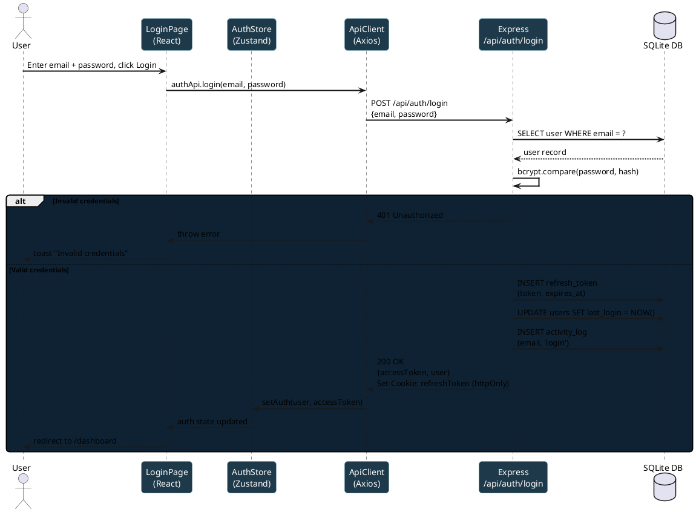

---

## 4. Sequence Diagram — Attendance Analysis

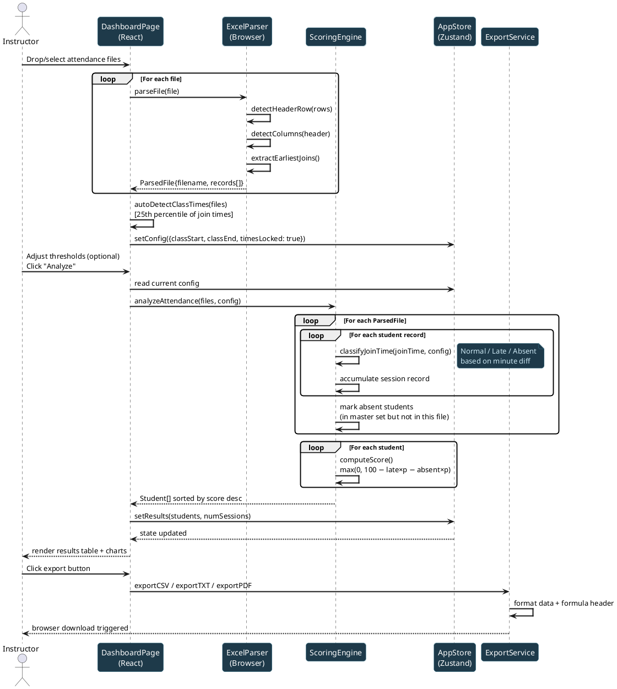

---

## 5. Sequence Diagram — Token Refresh (Silent)

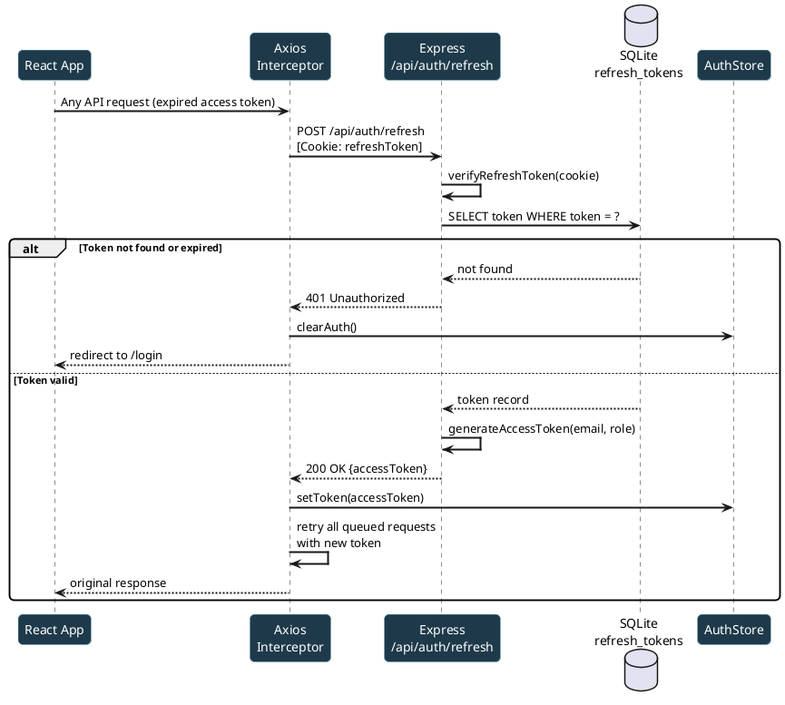

---

## 6. Sequence Diagram — Password Reset

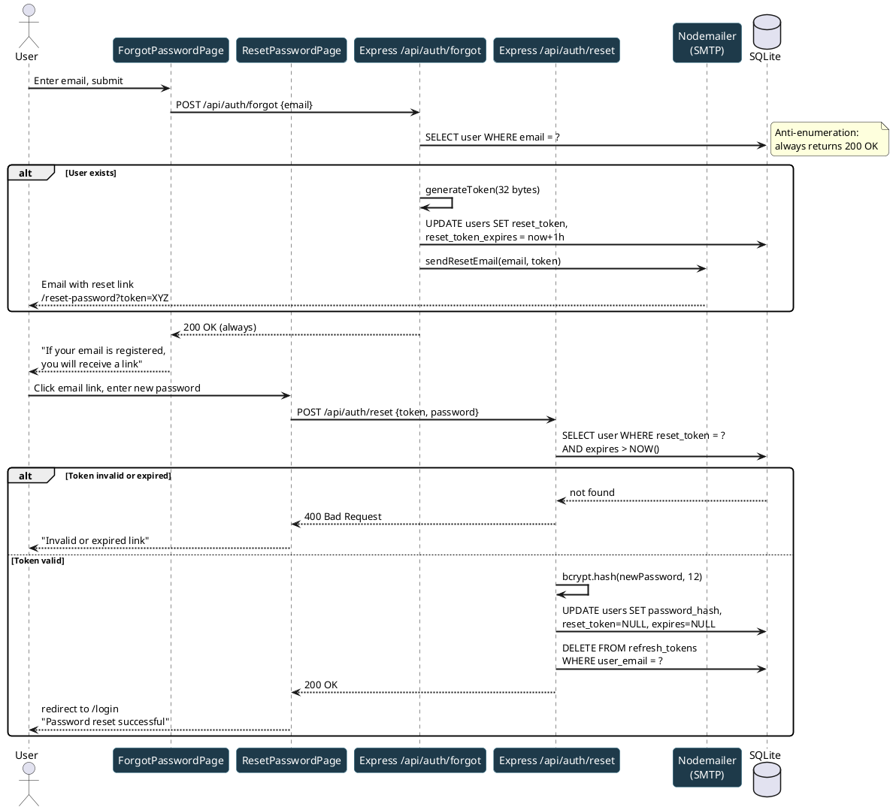

---

## 7. Component Diagram

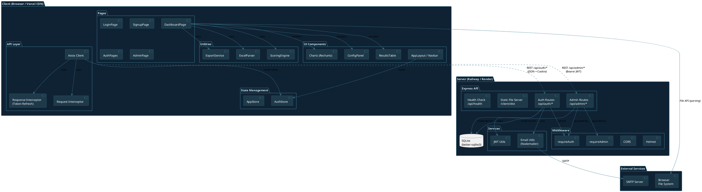

---

## 8. Deployment Diagram

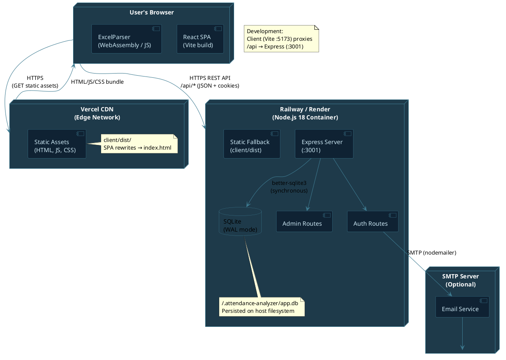

---

## 9. Entity-Relationship (ER) Diagram

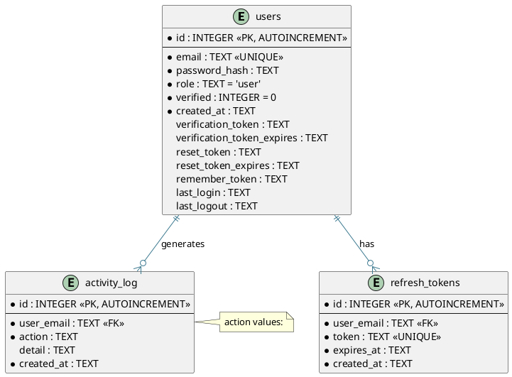

---

## 10. Activity Diagram — File Upload and Analysis

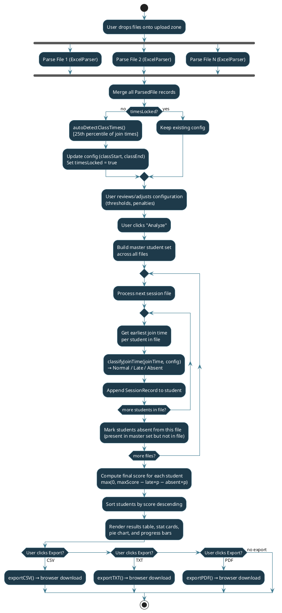

---

## 11. State Machine — Authentication Flow

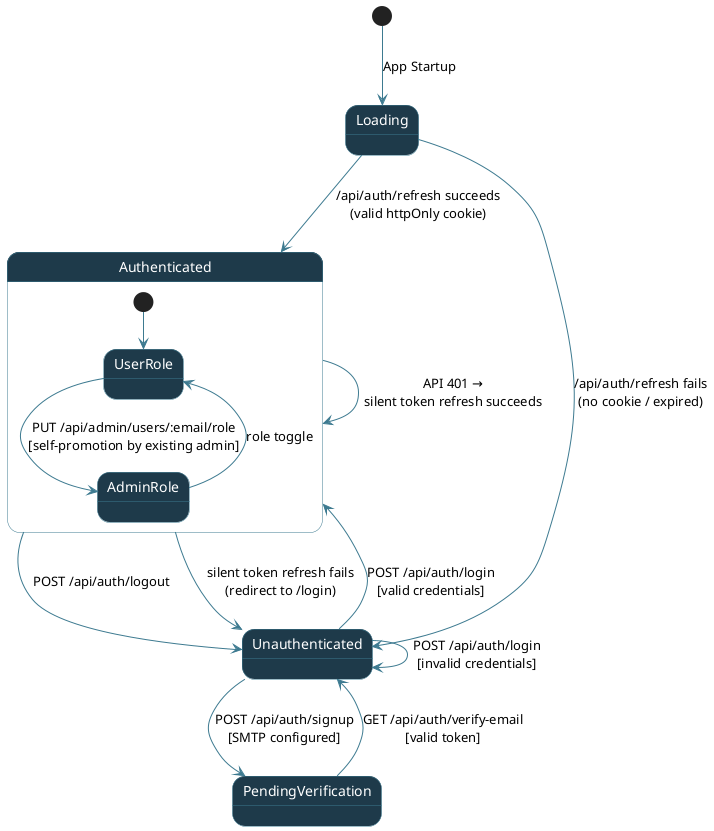
